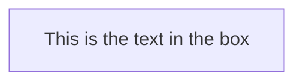

# Ceph 설치 방법 정리 



## single deployment -> multi

```mdx-code-block
import Tabs from '@theme/Tabs';
import TabItem from '@theme/TabItem';
import Zoom from 'react-medium-image-zoom';
```
<Zoom>


</Zoom>